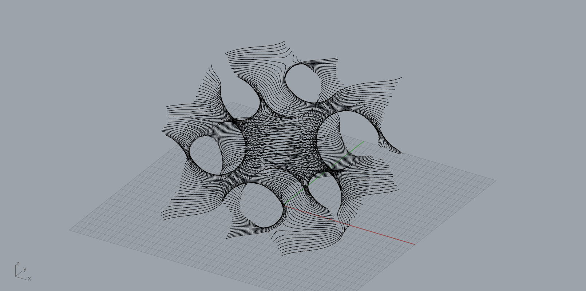
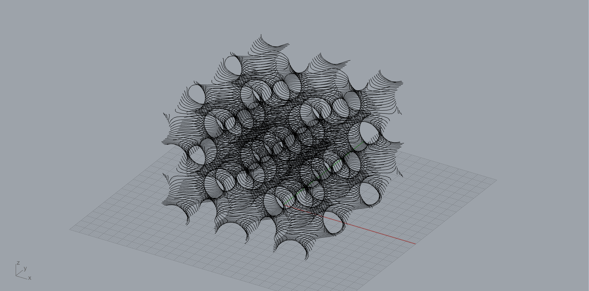
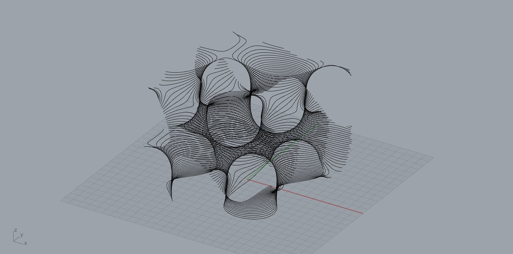
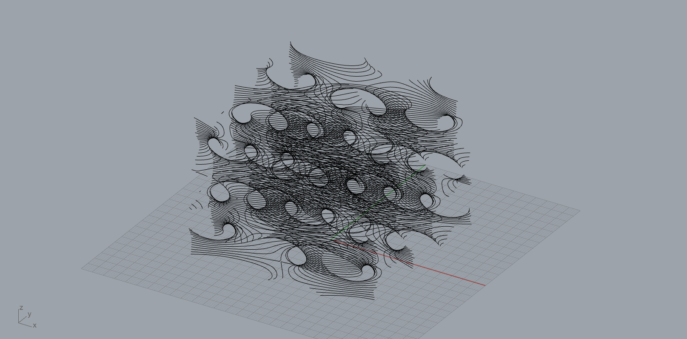
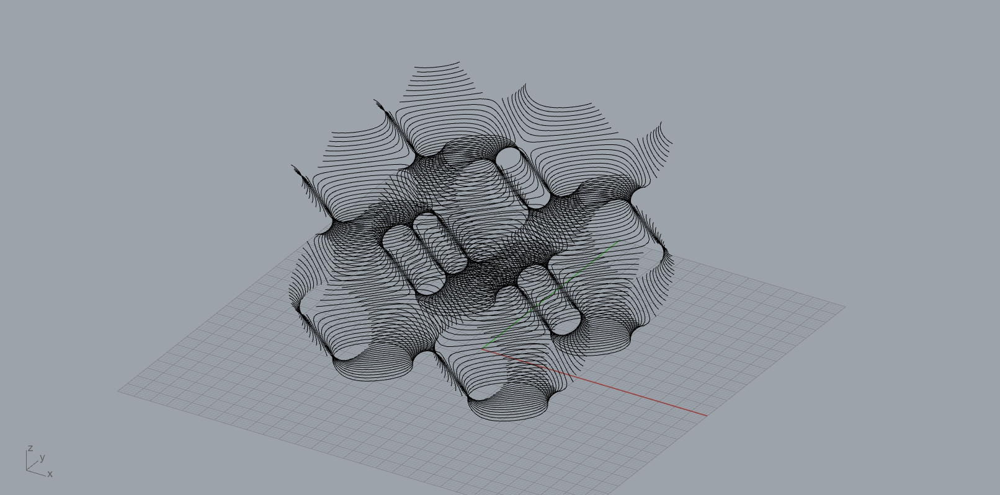

# implicitSlicer

implicit surface slicing for 3D printing
## Usage
You can start quickly in *line 55* in the file *main.py*
```
# MAIN ENTRANCE
allLay=makeAllLay(40,40,1,exprOperater(miniSrf, affineFun, (0.1, 0.2, 0.2),(0.5*math.pi, 0.5*math.pi, 0.33*math.pi)), 0.1, 1, 60, 1)
gcodeOut.writeGcodeBody(allLay,100.0,0.1,0.2)
```
The variables in parentheses represent:
*(Canvas SizeX, Canvas SizeY, Grid Size, Implicit Equation Expression, Value of Expression, Mode, Layers Count, Layer Height).*

### Drawing Mode
You can change the way the expression be drawn by changing the value of mode(0 or 1). ***"0"*** means draw with zigzag lines, ***"1"*** means draw with smooth lines.Look at the following two examples:

*Mode"0"*

*Mode"1"*

### Expression & Affine Transformation
The *Implicit Equation Expression* participates as ***exprOperater(Expression, AffineFun, (Scale X, Scale Y, Scale Z), (Rotate Z, Rotate Y, Rotate X))***,you can create personalized patterns by changing the expression and the rotation and scaling values.Also,look at the following examples:

*Same expression different scaling value*

*Same expression different rotation value*

*Same expression different scaling & rotation value*

*Different expression*
### Gcode Output
