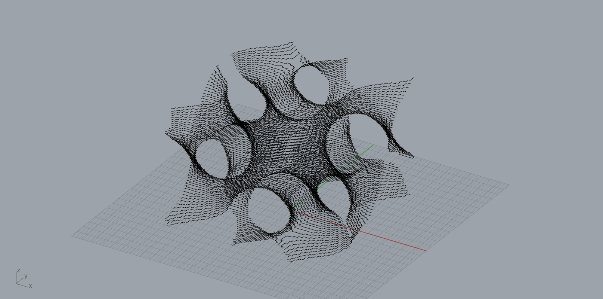

# implicitSlicer

implicit surface slicing for 3D printing

## Author
@aooiann/Jiayan Shao, https://github.com/aooiann
@Hao Hua,
@Inst. AAA, https://github.com/Inst-AAA

## Version
V1.0 (2022-04-08)

## Usage
Quick start by *line 55* in *main.py*
```
# MAIN ENTRANCE
allLay=makeAllLay(40,40,1,exprOperater(miniSrf, affineFun, (0.1, 0.2, 0.2),(0.5*math.pi, 0.5*math.pi, 0.33*math.pi)), 0.1, 1, 60, 1)
gcodeOut.writeGcodeBody(allLay,100.0,0.1,0.2)
```
The arguments represent:
*(Canvas SizeX, Canvas SizeY, Grid Size, Implicit Equation Expression, Value of Expression, Mode, Layers Count, Layer Height).*

### Display Platform
Either use *Rhinoceros* platform to display the generated graphics or disable the rhinoceros functions by commenting *line 50* in *main.py*.

### Drawing Modes
Switch between the two modes by mode value (0 or 1). ***"0"***: drawing zigzag lines, ***"1"***: drawing smooth lines. Two examples:

*Mode"0"*

*Mode"1"*

### Expression & Affine Transformation
The *Implicit Equation Expression* is written as ***exprOperater(Expression, AffineFun, (Scale X, Scale Y, Scale Z), (Rotate Z, Rotate Y, Rotate X))***, you can create personalized patterns by defining the expression and the rotating/scaling transformation. Two examples:

*Same expression different scaling value*

*Same expression different rotation value*

*Same expression different scaling & rotation value*

*Different expression*

### G-code Output
Based on the generated graphics, ***writeGcodeBody(allLays, origOffset, fr, raiseheight)*** in *gcodeOut.py* exports the G-code for 3D printing. *origOffset* equals the half of the width of the filament, *fr* denotes the height of the first layer, and *raiseheight* denotes the height raised at the path to avoid collision when starts printing the next path.

*Preview the print path*

*One of my printouts*

**Now, start generating your personalized graphics and print them out!** 

